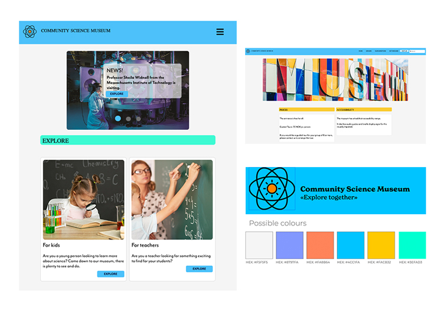

# Community Science Museum



### Info

This is a assignment I got from Noroff: 
An interactive science museum called the Community Science Museum is opening in your town/city. Its core target audience is primary and middle school children (7-15) and families with young children. 
The museum wants a website that is informative and appealing, that will attract both middle school pupils and their parents.

he website should be informative and engaging, but should encourage viewers to visit the museum itself. 
The website should be responsive and be easy to use on a variety of devices.

## Process

I created a work schedule with Trello and started out with the UX-design. 
I created user personas and when I had a better picture of target audience, I used the software Adobe XD to create the prototype. 

## Built with

- 

## Visit the site

- [Community Science Museum](https://gallant-visvesvaraya-6a0d3c.netlify.app/)

## Getting Started

### Installing

1. Clone the repo:

```bash
git clone https://github.com/maleneivy/squareeyesproject.git
```

2. Install the dependencies:

```
npm install
```

### Running

To run the app, run the following commands:

```bash
npm run start
```

## Contact

- [My LinkedIn page](https://www.linkedin.com/in/maleneivyolsen/)

- [Discord](https://www.discordapp.com/users/2217)


## License

This project is licensed under the Creative Commons license.
